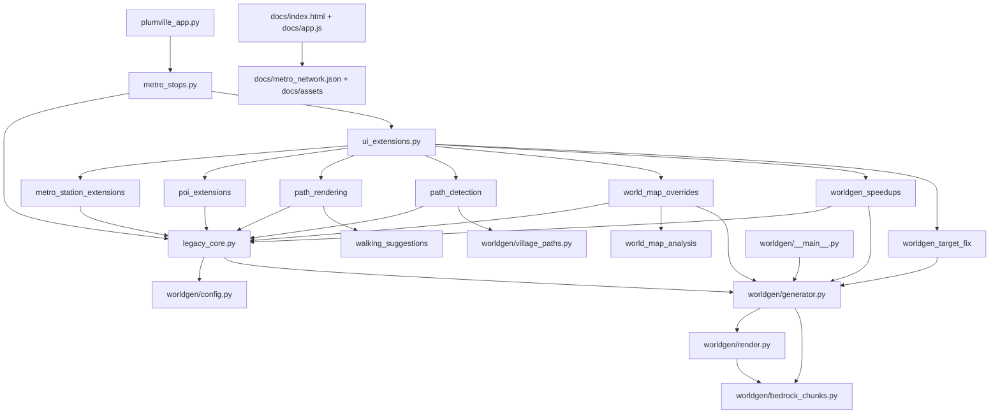

# Plumville Local Architecture And Performance Audit

Date: 2026-07-24

Scope: local architecture and performance audit only. No broad refactor, delete, move, commit, push, or public data expansion was performed.

## Executive Summary

The current application is active and functional, but organized around a large desktop monolith plus runtime patch modules:

- `legacy_core.py` is the canonical desktop/core implementation today.
- `metro_stops.py` is the preserved public desktop entry point. It imports `legacy_core` and applies extension patches through `ui_extensions.apply()`.
- `plumville_app.py` is a thin compatibility launcher that delegates to `metro_stops.main()`.
- `worldgen/` is a real package with the preserved `python3 -m worldgen` entry point.
- `docs/` is the GitHub Pages public viewer and must remain read-only.
- Ignored local/private/generated state is significant: `worldgen_data/`, `worldgen_output/`, `metro_network.history/`, `exports/`, `.worldgen/`, caches, and `node_modules/`.

The highest-risk architectural point is the patch chain installed by `ui_extensions.apply()`. Several files that may look transitional are definitely active at runtime.

## Workspace Inventory

Tracked source and public assets:

- Desktop entry points: `metro_stops.py`, `plumville_app.py`.
- Desktop/core implementation: `legacy_core.py`.
- Runtime patch/extension modules: `ui_extensions.py`, `metro_station_extensions.py`, `path_detection.py`, `path_rendering.py`, `poi_extensions.py`, `world_map_overrides.py`, `worldgen_speedups.py`, `worldgen_target_fix.py`.
- Shared helpers: `walking_suggestions.py`, `world_map_analysis.py`.
- Worldgen package: `worldgen/__main__.py`, `worldgen/generator.py`, `worldgen/render.py`, `worldgen/bedrock_chunks.py`, `worldgen/config.py`, `worldgen/cache.py`, `worldgen/docker_compose.py`, `worldgen/modes.py`, `worldgen/paths.py`, `worldgen/unknown_diagnostics.py`, `worldgen/village_paths.py`.
- Web viewer: `docs/index.html`, `docs/app.js`, `docs/styles.css`, `docs/smoke_test.js`.
- Public web data/assets: `docs/metro_network.json`, `docs/assets/blackport_topdown.png`, `docs/assets/blackport_lan_surface.png`, `docs/assets/blackport_topdown.render.json`.
- Scripts/tools: `scripts/smoke_tk_sidebar.py`, `scripts/performance_probe.py`, `tools/bedrock_lan_discover.mjs`.
- Tests: 11 Python test modules under `tests/`.

Local/private/generated or ignored:

- `worldgen_data/` around 3.1 GB: Bedrock server data, worlds, caches, backups, packet/cache outputs. Must never enter `docs/`.
- `worldgen_output/` around 5.3 MB: generated render images and diagnostics.
- `metro_network.history/` around 44 MB with 100 JSON snapshots.
- `exports/` around 30 MB with generated SVG exports.
- `.worldgen/`, `.pytest_cache/`, `__pycache__/`, `node_modules/`, `.DS_Store`, `metro_network.last.json`.

Approximate code size from `wc -l`: 33,405 lines across Python, web, tests, and scripts. `legacy_core.py` is 14,005 lines.

## Entry Points

- `python3 metro_stops.py`: applies UI/worldgen/path/POI extensions and launches desktop.
- `python3 plumville_app.py`: compatibility launcher for `metro_stops.main()`.
- `python3 -m worldgen`: CLI for status, startup/wait/load/render/repair-related worldgen operations.
- `npm run smoke:docs`: public viewer smoke test.
- `npm run smoke:tk`: opt-in Tk smoke test; skips unless `PLUMVILLE_RUN_TK_SMOKE=1`.
- `node docs/smoke_test.js`: direct web smoke test.
- `python3 scripts/performance_probe.py --repeat 7`: opt-in audit performance probe added in this pass.
- `tools/bedrock_lan_discover.mjs`: Bedrock LAN discovery helper.

## Dependency Diagram



## Active, Transitional, And Manual-Review Files

Definitely active:

- `legacy_core.py`, `metro_stops.py`, `plumville_app.py`, `ui_extensions.py`, all modules imported by `ui_extensions.py`, `walking_suggestions.py`, `world_map_analysis.py`, `worldgen/`, `docs/`, `tests/`, `scripts/smoke_tk_sidebar.py`.

Compatibility wrappers:

- `metro_stops.py`: required preserved entry point and extension installer.
- `plumville_app.py`: thin launcher.

Runtime monkey patches:

- `ui_extensions.py` patches `MetroMapViewer._build_route_panel`.
- `metro_station_extensions.py` patches `MetroMapViewer.redraw`, `_draw_selected_stop_info`, and adds metro station/line dialogs.
- `path_rendering.py` patches `_draw_extra_edges` and `_draw_path_nodes`.
- `path_detection.py` patches `_draw_extra_edges`, `_draw_path_nodes`, `_draw_selected_stop_info`, `_refresh_station_stats`.
- `world_map_overrides.py` patches world-map underlay/export behavior.
- `worldgen_speedups.py` patches `BedrockWorldGenerator` methods and desktop auto-fill finish text.
- `worldgen_target_fix.py` patches target-selection helpers in `worldgen.generator`.
- `poi_extensions.py` adds the POI dialog method.

Likely redundant or transitional:

- `worldgen_speedups.py` and `worldgen_target_fix.py`: working speed/target logic that should be integrated into canonical `worldgen/` modules after tests.
- `world_map_overrides.py`: world-map rendering behavior likely belongs in desktop/world-map modules after migration.
- `metro_station_extensions.py`, `path_detection.py`, `path_rendering.py`, `poi_extensions.py`: active feature modules currently installed as patches; do not delete.
- `plumville_app.py`: wrapper that can remain indefinitely or become documented compatibility entry.
- Generated export/history/cache files mixed near source root should remain ignored and eventually move under a clearer local runtime data boundary.

Manual review needed:

- `path_detection_state.json` is now ignored if written at repo root; a later cleanup can move it under a clearer local runtime data directory.
- `priority_list.csv` is tracked desktop data; confirm whether it is intentionally versioned.
- `metro_lines.txt` is tracked; confirm whether it is legacy input or still a canonical/manual source.
- `docs/metro_network.json` is public output and also the desktop load path today; this dual role is a boundary risk.
- `docs/assets/blackport_topdown.render.json` had pre-existing absolute local path values during the audit; those fields were sanitized to public relative paths or `null`.
- Station signage now expects `Amortay (U)` because `P_CU5` is a named Line C/Line U junction.

## Test Results

- `python3 -m pytest`: passed, 50 passed.
- `python3 -m unittest discover`: passed, 50 tests OK.
- `npm test`: passed; now aliases `npm run smoke:docs`.
- `npm run smoke:docs`: passed. Output: docs viewer assets load and terrain bounds match the PNG. A public metadata private-path assertion was added and passes.
- `npm run smoke:tk`: passed as a skip. It requires `PLUMVILLE_RUN_TK_SMOKE=1`.
- `env PLUMVILLE_RUN_TK_SMOKE=1 npm run smoke:tk`: exited with code 134 before normal pass/skip output; desktop UI measurement is not reliable in this shell session.

## Performance Baselines

Command: `python3 scripts/performance_probe.py --repeat 7`

| Probe | Median ms |
| --- | ---: |
| desktop import of `legacy_core` | 81.510 |
| network payload load | 5.523 |
| route graph, open metro | 0.173 |
| route Blackport to farthest reachable target `P_A9` | 1.036 |
| route costs from Blackport | 0.202 |
| plot transform | 0.347 |
| worldgen config load | 0.380 |
| worldgen render plan build | 0.003 |
| worldgen target planning | 234.905 |
| web network JSON parse | 1.532 |
| web app JS read | 0.070 |
| terrain metadata parse | 0.049 |
| public PNG asset copy to temp | 8.661 |

Measured route graph size: 36 nodes, 86 edges.

Measured bottlenecks:

- `worldgen_target_planning` is the clearest pure-code hotspot in this audit run.
- `legacy_core` import/startup cost is noticeable for a desktop app but not yet proven user-visible.
- Public asset copy time is non-trivial but far below target planning.

Baseline gaps requiring display/browser/live-world instrumentation:

- Desktop initial render, panning, zooming, station-label placement, and path addition.
- Web initial canvas render, panning, zooming, station-label placement, hit testing, and route calculation in-browser.
- Chunk loading, terrain decoding, terrain rendering, PNG writing from live Bedrock/world data.
- Village-path detection against real chunk data from the desktop dialog.

## Proposed Target File Tree

```text
Plumville/
  metro_stops.py
  plumville_app.py
  plumville/
    core/
      models.py
      network.py
      geometry.py
      routing.py
      travel_time.py
      validation.py
      serialization.py
    desktop/
      app.py
      viewer.py
      sidebar/
      station_editor.py
      line_editor.py
      path_editor.py
      construction.py
      world_map.py
      diagnostics.py
    publishing/
      public_export.py
      terrain_export.py
      sanitization.py
      validation.py
    diagnostics/
      profiling.py
  worldgen/
    __main__.py
    config.py
    modes.py
    loading/
      headless.py
      targets.py
      coverage.py
    rendering/
      renderer.py
      tiles.py
      classification.py
      metadata.py
    analysis/
      village_paths.py
    diagnostics/
      unknown_blocks.py
      repair.py
  docs/
    index.html
    styles.css
    js/
      main.js
      state.js
      camera.js
      rendering.js
      labels.js
      routing.js
      construction.js
      ui.js
    assets/
  scripts/
  tests/
  development/
```

Preserve `metro_stops.py`, `python3 -m worldgen`, and `docs/` GitHub Pages throughout migration.

## Prioritized Migration Sequence

1. Fix or intentionally update the two station-signage tests so the baseline is green.
2. Add tests around public export sanitization and ensure `docs/` never receives local paths, caches, private notes, diagnostics, or history.
3. Extract pure routing/travel-time/geometry/network serialization from `legacy_core.py` into `plumville/core/`, keeping `legacy_core` compatibility imports.
4. Move worldgen target-selection patch logic from `worldgen_target_fix.py` into tested `worldgen/loading/targets.py`.
5. Move worldgen speedup behavior from `worldgen_speedups.py` into canonical `worldgen/generator.py` or smaller worldgen modules with config flags.
6. Extract desktop viewer/sidebar code from `legacy_core.py` into `plumville/desktop/` in small wrappers.
7. Move public export/publishing behavior behind `plumville/publishing/` with dry-run validation.
8. Split `docs/app.js` into focused modules only after adding browser-level smoke/performance coverage.
9. Add segment construction status and construction dashboard after the public/private export boundary is explicit.

## Script Recommendations

Retain unchanged for now:

- `scripts/smoke_tk_sidebar.py`
- `tools/bedrock_lan_discover.mjs`
- `docs/smoke_test.js`

Retain as audit/developer tooling:

- `scripts/performance_probe.py`

Move later:

- Generated `exports/` and `metro_network.history/` should remain ignored and could move under a clearer local runtime folder after compatibility checks.

Consolidate or absorb:

- `worldgen_speedups.py` into canonical worldgen generator/render modules.
- `worldgen_target_fix.py` into canonical worldgen target planning.
- `world_map_overrides.py` into desktop world-map rendering/export modules.
- `path_rendering.py` and `path_detection.py` into desktop path modules plus `worldgen.analysis`.

Convert into compatibility wrappers:

- `legacy_core.py` only after core/desktop extractions are tested.
- Extension modules only after their contents are absorbed into canonical modules.

Deprecate only after testing:

- `metro_lines.txt`, if no longer canonical.
- Any duplicate generated render outputs in `worldgen_output/`.

Delete only after explicit approval:

- No files should be deleted from this audit alone.

## Low-Risk Cleanup Opportunities

- Later, move `path_detection_state.json` under a clearer ignored runtime data directory instead of leaving root-path fallback state.
- Expand `npm test` beyond `smoke:docs` when browser-level tests exist.
- Document `scripts/performance_probe.py` in `README.md`.
- Public terrain metadata now has a smoke assertion for private path fragments; extend that into broader public-output sanitization tests before export changes.
- Add a tiny import smoke test for `metro_stops._apply_extensions_once()`.

## High-Risk Areas Requiring Tests

- `legacy_core.py` global state initialization and JSON load/save.
- Any mutation of station IDs or line membership.
- Runtime monkey-patch order in `ui_extensions.apply()`.
- Path node and extra-edge editing.
- Worldgen target selection and incremental render preservation.
- Public export boundary between desktop data and `docs/`.
- `docs/app.js` route/search/camera behavior before splitting modules.

## Proposed Test Plan

- Keep `python3 -m pytest` and `python3 -m unittest discover` green before migrations.
- Add focused tests for `metro_stops._apply_extensions_once()` idempotency.
- Add route graph and travel-time regression tests around representative multi-line trips.
- Add tests for `worldgen_target_fix` behavior before moving it.
- Add tests for speedup behavior: preserving existing image, rendering only blank pixels, docs asset copying.
- Add public-output sanitization tests for forbidden strings and fields.
- Add browser-level web tests for camera transforms, label placement, route calculation, and shareable URL state.

## Recommended First Refactor Task

The deterministic baseline is green. The recommended first refactor task is now:

1. Add an idempotency test for `metro_stops._apply_extensions_once()`.
2. Add broader public-output sanitization tests around exported JSON, not only terrain metadata.
3. Start extracting pure routing/travel-time/geometry code from `legacy_core.py` behind compatibility imports.

## Files Created Or Modified In This Audit

- Created: `ARCHITECTURE_AUDIT_2026-07-24.md`
- Created: `scripts/performance_probe.py`
- Modified: `docs/assets/blackport_topdown.render.json`
- Modified: `docs/smoke_test.js`
- Modified: `.gitignore`
- Modified: `package.json`
- Modified: `tests/test_station_signage.py`
- Modified: `notes.txt`

## Commands Run

```text
pwd
ls
sed -n '1,240p' notes.txt
git status --short
sed -n '241,520p' notes.txt
sed -n '521,920p' notes.txt
rg -n "\\[[ xX]\\]|TODO|IMPLEMENT|Phase|Task|Current|priority|Priority" notes.txt
rg --files
sed -n '921,1120p' notes.txt
find . -maxdepth 3 -type d -print
find . -maxdepth 3 -type f -print
git status --short --ignored
git diff -- notes.txt
sed -n '720,940p' notes.txt
sed -n '1,220p' metro_stops.py
sed -n '1,220p' plumville_app.py
sed -n '1,220p' legacy_core.py
cat package.json
sed -n '1,260p' ui_extensions.py
sed -n '1,260p' metro_station_extensions.py
sed -n '1,240p' path_detection.py
sed -n '1,220p' path_rendering.py
rg -n "^def apply|_ORIGINAL_|base\\.MetroMapViewer|import |from " metro_station_extensions.py path_detection.py poi_extensions.py world_map_overrides.py worldgen_speedups.py worldgen_target_fix.py walking_suggestions.py world_map_analysis.py worldgen/*.py docs/app.js docs/smoke_test.js scripts/smoke_tk_sidebar.py tests/*.py
sed -n '1,220p' worldgen_speedups.py
sed -n '1,240p' worldgen_target_fix.py
sed -n '1,220p' world_map_overrides.py
rg -n "profil|perf|time\\.|monotonic|benchmark|startup|redraw|after\\(|requestAnimationFrame|performance\\.now|console\\.time" . --glob '!node_modules/**' --glob '!worldgen_data/**' --glob '!metro_network.history/**' --glob '!__pycache__/**' --glob '!*.pyc'
sed -n '1,260p' docs/smoke_test.js
sed -n '1,220p' scripts/smoke_tk_sidebar.py
rg -n "def (redraw|__init__|main|plot_stops|_draw|_render|_save|_load|find|route|shortest|path|world_map|auto_fill)|class MetroMapViewer|def _world_map|def load|def save" legacy_core.py worldgen/generator.py worldgen/render.py docs/app.js --glob '!node_modules/**'
cat requirements.txt
python3 -m pytest
npm test
npm run smoke:docs
npm run smoke:tk
python3 -m unittest discover
env PLUMVILLE_RUN_TK_SMOKE=1 npm run smoke:tk
python3 - <<'PY' ... AST import/dependency map ...
rg -n "def .*route|def .*directions|def .*distance|def .*travel|find_route|shortest|Dijkstra|heapq|_route|route_" legacy_core.py docs/app.js tests/test_railway_timing.py
sed -n '1130,1480p' legacy_core.py
sed -n '1460,1740p' legacy_core.py
sed -n '1690,1845p' worldgen/generator.py
rg -n "def build_suggested_segments|class TerrainGrid" walking_suggestions.py
sed -n '1,260p' walking_suggestions.py
sed -n '260,560p' walking_suggestions.py
sed -n '4770,5015p' legacy_core.py
python3 scripts/performance_probe.py --repeat 7
git ls-files
git ls-files --others --exclude-standard
git check-ignore -v .DS_Store .pytest_cache node_modules worldgen_data worldgen_output metro_network.history metro_network.last.json exports .worldgen 2>/dev/null
find . -maxdepth 2 -type f -name '*.py' -o -name '*.js' -o -name '*.json' -o -name '*.png' -o -name '*.svg' -o -name '*.txt' -o -name '*.csv' -o -name '*.toml' -o -name '*.yml'
wc -l *.py worldgen/*.py tests/*.py scripts/*.py docs/app.js docs/smoke_test.js docs/index.html docs/styles.css
du -sh docs worldgen_data worldgen_output metro_network.history exports node_modules .worldgen 2>/dev/null
find worldgen_data -maxdepth 2 -type f | wc -l
find metro_network.history -maxdepth 1 -type f | wc -l
sed -n '1,120p' docs/assets/blackport_topdown.render.json
npm run smoke:docs
rg -n "/Users/|Library/Application Support|worldgen/cache|worldgen/output|headless_chunk_packets|uncolored_blocks_report|unfinished_points" docs
python3 -m json.tool docs/assets/blackport_topdown.render.json
git diff -- docs/assets/blackport_topdown.render.json
npm run smoke:docs
rg -n "/Users/|Library/Application Support|worldgen/cache|worldgen/output|headless_chunk_packets|bedrock-data" docs
git diff -- docs/smoke_test.js
rg -n "/Users/|Library/Application Support|worldgen/cache|worldgen/output|headless_chunk_packets|bedrock-data" docs/assets docs/metro_network.json docs/index.html docs/app.js docs/styles.css
python3 -m py_compile scripts/performance_probe.py
python3 scripts/performance_probe.py --repeat 1 --json
git status --short --ignored
rg -n "/Users/|home-directory|credentials|private notes|cache paths" docs ARCHITECTURE_AUDIT_2026-07-24.md notes.txt
git status --short --ignored
git diff --stat
sed -n '818,838p' notes.txt
rg -n "\\[ \\]" notes.txt
sed -n '1,120p' tests/test_station_signage.py
rg -n "P_C3|Amortay|P_U|\\\"U\\\"|LINE_STOP_VARS|line_stop_vars" legacy_core.py docs/metro_network.json tests/test_station_signage.py
cat .gitignore
cat package.json
python3 - <<'PY' ... verify Amortay station membership ...
sed -n '680,708p' docs/metro_network.json && sed -n '2678,2692p' docs/metro_network.json && sed -n '2911,2920p' docs/metro_network.json
python3 -m pytest
python3 -m unittest discover
npm test
npm run smoke:tk
rg -n "failed|fails|failure|Amortay|npm test|path_detection_state|Recommended First Refactor|Test Results|Manual review|Low-Risk|Files Created" ARCHITECTURE_AUDIT_2026-07-24.md
```
